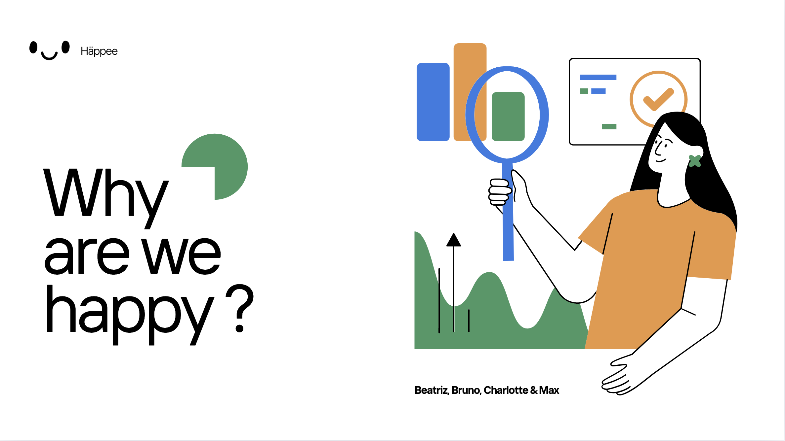

# Happiness Project 🌍😊

This project, **Häppee**, explores global happiness data using the **World Happiness Report** and the **Human Development Index (HDI)** datasets to identify factors influencing well-being globally. We built hypotheses, analyzed data, and derived valuable insights.

---

## Table of Contents
- [About the Project](#about-the-project)
- [Datasets Used](#datasets-used)
- [Database Design](#database-design)
- [Hypotheses](#hypotheses)
- [Key Findings](#key-findings)
- [Lessons Learned](#lessons-learned)
- [Contributors](#contributors)

---

## About the Project
The goal of this project is to understand and analyze happiness metrics worldwide, considering economic, social, and developmental factors. The analyses include exploring the correlation between happiness scores, GDP per capita, and HDI levels.

---

## Datasets Used
### **World Happiness Report**
- Source: Kaggle
- Description: A dataset offering a comprehensive examination of happiness metrics and influencing factors globally (up to 2023).

### **Human Development Index (HDI)**
- Source: UNDP
- Description: A summary measure of average achievements in health, education, and income dimensions.

---

## Database Design
The database links the **World Happiness Report** and **HDI** datasets using the `Country` as a foreign key. This allows for cross-referencing life expectancy, health metrics, and other key indicators by country.

---

## Hypotheses
1. **Western Europe and North America consistently rank higher in happiness compared to other regions.**
2. **Higher GDP per capita is strongly correlated with higher happiness scores.**
3. **Countries with higher HDI values have higher happiness scores.**

---

## Key Findings
### **1. Regional Happiness Rankings**
- **North America and ANZ** lead with an average happiness score of **7.09**, followed by **Western Europe** with **6.9**.

### **2. GDP and Happiness Correlation**
- The Pearson correlation coefficient between GDP per capita and happiness is **0.7637**, indicating a strong positive relationship.

### **3. HDI and Happiness**
- Countries with **higher HDI values** (e.g., Switzerland, Norway) tend to have significantly higher happiness scores.

| **HDI Level** | **Avg. Happiness Score** |
|---------------|---------------------------|
| High HDI      | 6.85                     |
| Medium HDI    | 5.23                     |
| Low HDI       | 4.32                     |

---

## Lessons Learned
- Initial challenges with the dataset required a pivot to a more manageable and reliable dataset.
- Collaboration and adaptability were key to overcoming obstacles.
- The importance of **checking the usability of the dataset before diving into hypotheses** was a critical learning point.

---

## Contributors
- Beatriz
- Bruno
- Charlotte
- Max

---

Thank you for exploring the **Häppee Project**! 😊
